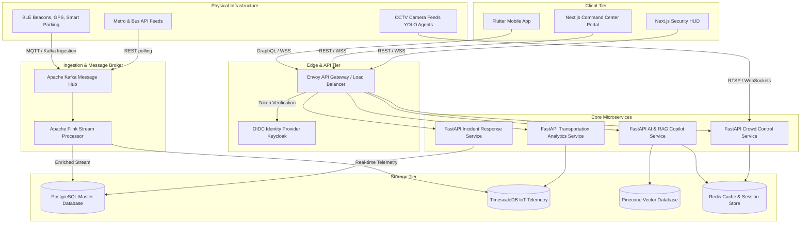
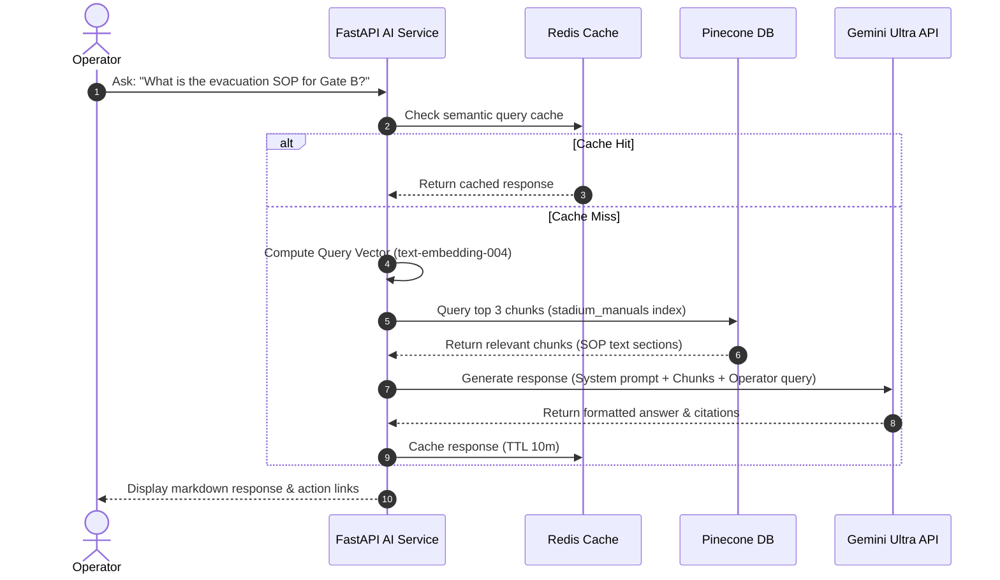
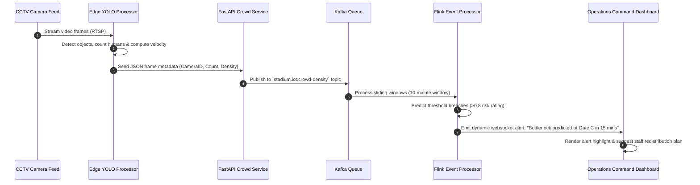

# System Architecture Specification - Smart Stadium Operations Platform

This document describes the high-level design, components, AI workflow, data flow, and scalability strategies for the **FIFA World Cup 2026 Smart Stadium Operations Platform**.

---

## 1. High-Level Architecture Overview

The system is designed as a cloud-native, distributed event-driven platform capable of handling millions of concurrent fan connections and thousands of high-velocity IoT sensors, CCTV YOLO video feeds, and emergency alerts.

---

## 2. Component Breakdowns

### Client Tier
* **Fan Mobile App**: Cross-platform client written in Flutter. Leverages Mapbox SDK for indoor routing, offline BLE beacons, and speech synthesis APIs for accessibility.
* **Operations Command Center Portal**: High-fidelity dashboard built using Next.js, React Leaflet for GIS coordinates, and Chart.js for real-time analytics.
* **Security HUD**: Tactical operator dashboard specializing in CCTV stream processing, bounding-box overlays, risk scoring, and real-time alert notifications.

### Ingestion & Stream Processing Tier
* **Apache Kafka**: Serves as the central commit log. Telemetry, ticketing logs, and parking data are sent to specific Kafka topics (e.g., `stadium.iot.crowd-density`, `stadium.incident.alerts`).
* **Apache Flink**: Performs windowed aggregations on crowd sensor telemetry and ticket-scanning velocities to detect bottlenecks and compute 15-minute predictive congestion scores.

### Application Services Tier (FastAPI & Python AI)
* **AI & RAG Copilot Service**: Host LLM agents using FastAPI. Connects with LangChain to run prompt workflows, query the vector store for stadium SOPs, and translate queries to 50+ languages.
* **Crowd Control & Vision Service**: Receives frame-metadata from local edge YOLO containers, maps camera telemetry coordinates to GIS digital twins, and updates Redis with live crowd heatmaps.
* **Incident & Resource Allocation Service**: Computes staffing workloads and volunteer requirements using a MILP (Mixed-Integer Linear Programming) optimizer.

### Data Storage Tier
* **PostgreSQL (Multi-AZ)**: Structured system records including user accounts, incident reports, volunteer rosters, match details, and ticket status.
* **TimescaleDB**: PostgreSQL extension optimized for time-series. Captures all sensor readings (temperatures, carbon count, queue sizes) for long-term historical trends.
* **Pinecone**: Managed vector database. Indexes all semantic fragments of stadium manuals, FIFA safety guides, and venue SOPs.
* **Redis Enterprise**: Sub-millisecond key-value store for active sessions, user locations, websocket connection mappings, and local geo-fencing caches.

---

## 3. Core AI Workflows

### 3.1. RAG & Knowledge Hub Workflow

### 3.2. Computer Vision & Congestion Mitigation Workflow

---

## 4. Technology Stack Justification

| Technology | Selected For | Rationale |
| :--- | :--- | :--- |
| **FastAPI (Python)** | Backend Services | High execution speed, asynchronous event loops, native support for Pydantic type validation, and direct compatibility with machine learning runtimes (PyTorch, YOLO, OpenCV). |
| **Next.js & React** | Web Dashboard | Server-Side Rendering (SSR) for initial load efficiency, modular component reuse, clean React context-state, and strong typing with TypeScript. |
| **Pinecone** | Vector DB | Fully managed serverless scaling, high query throughput, sub-50ms latency, and robust support for metadata filtering based on stadium location or language. |
| **TimescaleDB** | Time-Series Data | Combines the full query power and transaction safety of PostgreSQL with optimized indexing structures (hypertables) for high-frequency IoT telemetry. |
| **Kafka & Flink** | Stream Processing | Standard enterprise solution for decoupling ingestion from analytical workloads. Guarantees "at-least-once" delivery, vital for emergency incident handling. |
| **Envoy Gateway** | API Gateway | Handles token translation, rate limiting, and seamless routing for both HTTP/gRPC traffic and persistent WebSocket channels. |

---

## 5. Scalability & Availability Strategy

* **Horizontal Pod Autoscaling (HPA)**: Deploy microservices on Kubernetes (EKS/GKE). Scale pods dynamically based on target CPU (>70%) and concurrent WebSocket connection metrics.
* **Geo-Distributed Edge CDN**: Use Cloudflare to cache static assets, maps, and multilingual translation models close to fans in the US, Mexico, and Canada.
* **Read-Replication & Connection Pooling**: Implement PgBouncer for PostgreSQL database pools. Route read operations to read-replicas while keeping write traffic on the master instance.
* **WebSocket Sharding**: Route WebSocket connections through a Redis Pub/Sub backplane, allowing fans to receive localized stadium broadcasts even when connected to different physical server pods.
