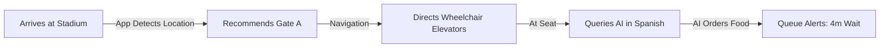

# UI/UX Wireframes & User Journeys

This document details the user journey workflows and interface layouts for the **FIFA World Cup 2026 Smart Stadium Operations Platform**.

---

## 1. User Journeys by Persona

### 1.1. Fan Persona (Wheelchair Access & Language Needs)
* **Goal**: Arrive at the stadium, enter via an accessible gate, navigate to seat, and order food in native language (Spanish) with minimal delays.
* **Journey Map**:

1. **Discovery**: On boarding, app detects language preference `es` (Spanish) and accessibility preference `wheelchair_routing: true`.
2. **Navigation**: System calculates route, routing around escalators and staircases. Points fan to Elevators 2 & 3.
3. **Assistance**: Fan asks AI assistant: *"¿Dónde puedo conseguir agua sin escaleras?"* (Where can I get water without using stairs?). The AI responds in Spanish, displaying a route map to Stand 4 (Level 1) and details queue waiting time.

---

### 1.2. Operations Commander Persona (Command Center Operator)
* **Goal**: Monitor overall stadium health, detect overcrowding, and execute staff allocations via the AI Copilot.
* **Journey Map**:
1. **Monitoring**: Operator sees a flashing orange indicator on the interactive map: Gate B density reaches `0.85`.
2. **Analysis**: Operator opens the Operations Copilot panel. Queries: *"Show gate congestion status and suggest adjustments."*
3. **Execution**: AI recommends redeploying 4 volunteers to Gate B and routing incoming transit shuttle schedules to Gate A. Operator clicks "Approve Mitigation Plan" button to automatically send push notifications to team leaders.

---

### 1.3. Security Officer Persona
* **Goal**: Receive threat alerts (e.g. suspicious object), review CCTV feed overlays, and execute emergency SOPs.
* **Journey Map**:
1. **Trigger**: Computer Vision edge node detects an unattended bag near Stand 104.
2. **Alert**: Security dashboard sounds a critical audio alarm. The camera feed is automatically focused and boxed.
3. **Resolution**: Security officer reviews the AI-generated SOP: *"1. Dispatch Sector 4 Officer. 2. Establish 20m cordon. 3. Prepare standby announcement."* Officer coordinates with dispatch and marks the incident resolved.

---

## 2. Web UI/UX Wireframe Layouts

### 2.1. Operations Command Center (Next.js Dashboard)
```
+---------------------------------------------------------------------------------------------------+
| [FIFA 2026 Logo]  COMMAND CENTER  |  Map | Security | Sustainability | Transit |  14:32:10 UTC  |
+-----------------------------------+--------------------------------------------+------------------+
|  LEFT PANEL: SYSTEM METRICS       |  CENTER: DIGITAL TWIN INTERACTIVE MAP      | RIGHT PANEL:     |
|  +-----------------------------+  |  +--------------------------------------+  | AI COPILOT       |
|  | CROWD COUNT: 64,281 / 70k   |  |  | [Gate A] [Stand 1]   (Heatmap On)    |  | +--------------+ |
|  | ACTIVE INCIDENTS: 2 (High)  |  |  |                                      |  | | Chat History | |
|  | AVG Q-TIME: 11 mins         |  |  |             [ Pitch ]                |  | |              | |
|  +-----------------------------+  |  |                                      |  | | User: Gate B?| |
|  | ALERT FEED (Real-Time)      |  |  |    [Stand 2] [Gate B (Bottleneck)]   |  | | AI: Congested| |
|  | [!] 14:31 - Gate B Jammed   |  |  |                                      |  | | [Approve]    | |
|  | [!] 14:28 - Medical Stand 104|  |  +--------------------------------------+  | +--------------+ |
|  +-----------------------------+  |  | CONTROL: [Toggle Heatmap] [Show Zones] |  | [Type message] |
|  | RESOURCE UTILIZATION        |  |  +--------------------------------------+  | [Accessibility]|
|  | Security: 88%  Vol: 92%     |  |                                            | | - Low Vision  |
|  +-----------------------------+  |  |                                            | | - Contrast    |
+-----------------------------------+--------------------------------------------+------------------+
```

---

## 3. Fan Mobile App Layout (Flutter App)

The Fan App interface is nested within a smartphone preview frame in the prototype dashboard, simulating the end-user's view.

### 3.1. Main Navigation Screens
* **Home Screen**: Displays digital ticket QR code, next match schedule (e.g. *USA vs. Germany*), and quick navigation shortcuts.
* **Smart Nav Screen**: Interactive stadium map detailing:
  - Wheelchair accessible paths (low gradient, elevator coordinates).
  - Restrooms (male, female, gender-neutral, accessible).
  - Queue lengths (color-coded: Green `< 5m`, Orange `5-15m`, Red `> 15m`).
* **Multilingual AI Assist**: Single-press microphone button to start real-time conversation. Supporting camera input for translating physical signages (OCR translation).
* **Low-Vision & High-Contrast Mode**: Increases font sizes by 50%, disables background textures, swaps default elements to high-contrast colors (yellow-on-black or white-on-black), and triggers screen-reader voice cues.
